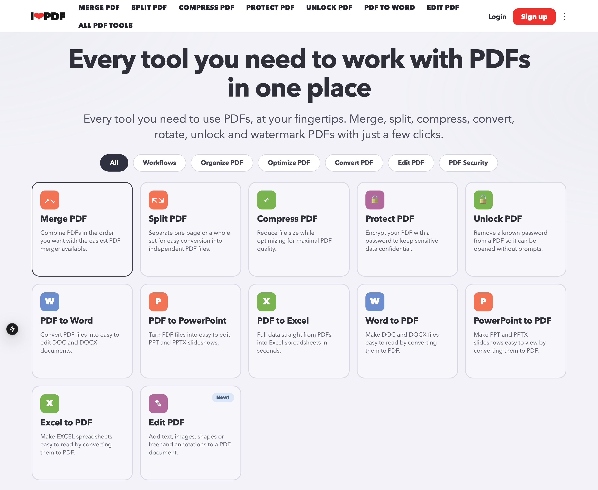

# iHatePDF (Open-Source iLovePDF Alternative)



This repo is a self-hosted, open-source PDF platform starter with these implemented features:

- Merge PDF files (ordered merge)
- Split PDF files (single or multiple ranges)
- Compress PDF files
- Protect PDF files (password encryption)
- Unlock PDF files (password removal)
- PDF to Word conversion
- PDF to PowerPoint conversion
- PDF to Excel conversion
- Edit PDF (text, image, rectangle overlays)
- Sign PDF files (image signature placement)
- Signature requests (email link + remote sign page)

## Stack

- Frontend: Next.js + React + TypeScript
- API: NestJS + Fastify + Prisma
- Worker: BullMQ + pdf-lib
- Data: PostgreSQL
- Queue: Valkey
- File storage: local filesystem (`./storage`)
- Email (local dev): Mailpit

## Project Structure

- `/apps/web` Next.js app
- `/apps/api` NestJS API
- `/apps/worker` background job worker
- `/packages/shared` shared types/schemas
- `/docker-compose.yml` local OSS infrastructure services

## Prerequisites

- Node.js 22+
- pnpm 9+
- Docker + Docker Compose

## Quick Start

1. Configure env files:

```bash
cp .env.example .env
cp apps/api/.env.example apps/api/.env
cp apps/worker/.env.example apps/worker/.env
cp apps/web/.env.example apps/web/.env.local
```

2. Set strong database credentials:

- Update `POSTGRES_USER`, `POSTGRES_PASSWORD`, `POSTGRES_DB` in `.env`.
- Use a long random password (at least 32 characters).
- Set the same user/password in `DATABASE_URL` for:
  - `apps/api/.env`
  - `apps/worker/.env`

3. Start infrastructure:

```bash
docker compose up -d
```

4. Install dependencies:

```bash
pnpm install
```

5. Run Prisma migration:

```bash
pnpm --filter @ihatepdf/api prisma:generate
pnpm --filter @ihatepdf/api prisma migrate deploy
```

6. Start all apps:

```bash
pnpm dev
```

7. Open apps:

- Web UI: http://localhost:3000
- API: http://localhost:4000/api
- Mailpit inbox: http://localhost:8025

## Compromise Recovery

If you find unexpected databases such as `readme_to_recover`, treat the instance as compromised:

1. Stop and remove containers + data volume:

```bash
docker compose down -v
```

2. Rotate to new strong database credentials in `.env` and app env files.

3. Start fresh:

```bash
docker compose up -d
pnpm --filter @ihatepdf/api prisma:generate
pnpm --filter @ihatepdf/api prisma migrate deploy
pnpm dev
```

## Feature API Endpoints

- `POST /api/uploads` (JSON with `fileName`, `mimeType`, `dataBase64`)
- `GET /api/files/:id/download`
- `POST /api/tasks/merge`
- `POST /api/tasks/split`
- `POST /api/tasks/sign`
- `POST /api/tasks/compress`
- `POST /api/tasks/protect`
- `POST /api/tasks/unlock`
- `POST /api/tasks/pdf-to-word`
- `POST /api/tasks/pdf-to-powerpoint`
- `POST /api/tasks/pdf-to-excel`
- `POST /api/tasks/edit`
- `GET /api/tasks/:id`
- `POST /api/signature-requests`
- `GET /api/signature-requests/:token`
- `POST /api/signature-requests/:token/complete`

## Notes

- Split returns:
  - PDF when one range is requested
  - ZIP when multiple ranges are requested
- Sign coordinates (`x`, `y`) use PDF points from bottom-left origin.
- Uploaded and processed files are stored under `./storage` by default.
- Protect PDF uses `qpdf`; install locally with `brew install qpdf` if running without Docker.
- Unlock PDF uses `qpdf` and requires the current document password.
- Conversion outputs are generated as Office Open XML files (`.docx`, `.pptx`, `.xlsx`) from extracted PDF text.
